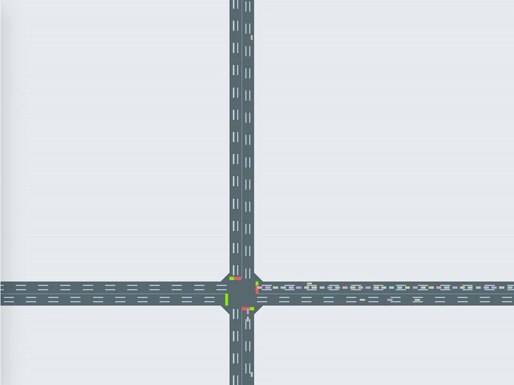
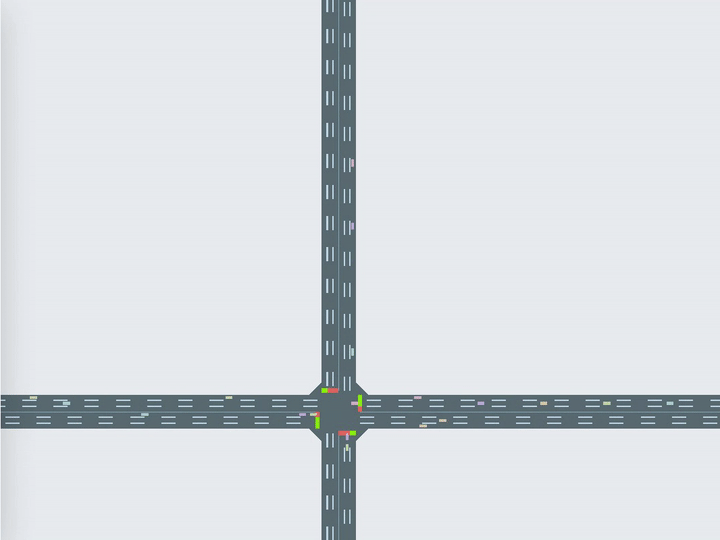
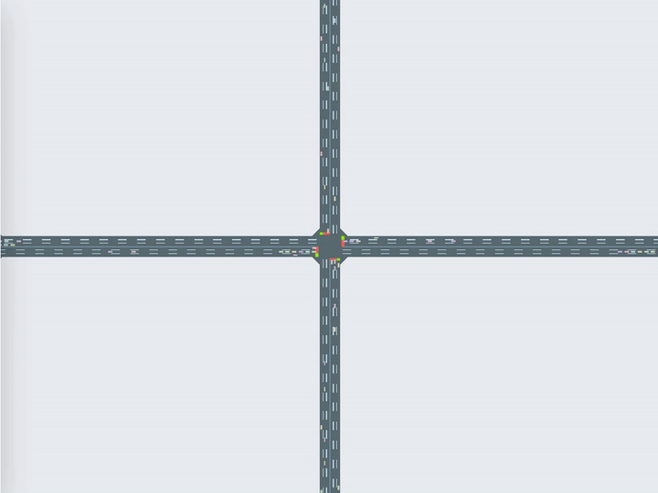

# MARL para semáforos inteligentes

**Idioma / Language**: **ES** | [EN](README.en.md)

Pipeline experimental de Trabajo Fin de Máster sobre **control adaptativo de semáforos urbanos mediante Multi-Agent Reinforcement Learning (MARL)**, evaluando siete algoritmos sobre dos benchmarks de tráfico real (Hangzhou 4×4 y Jinan 3×4) con el simulador CityFlow y el framework LibSignal.

- **Autor**: Héctor Fernández San Sotero
- **Dirección**: Francisco Soltero
- **Centro**: Universidad Alfonso X el Sabio (UAX)
- **Curso**: 2025-2026

> Política de mantenimiento bilingüe: `README.md` es la versión principal en español. La versión en inglés está en `README.en.md`; cualquier cambio de contenido en uno debe replicarse en el otro para mantener ambas versiones alineadas.

---

## ¿De qué va este trabajo?

Los semáforos tradicionales operan con ciclos predefinidos que no se adaptan al tráfico real. Los enfoques basados en MARL permiten que cada intersección sea un agente que aprende su política de señalización cooperando con sus vecinos, reduciendo tiempos de viaje entre un 25 % y un 44 % en simulación.

Sobre el framework **LibSignal** (que unifica varios simuladores y algoritmos del estado del arte) se han evaluado siete algoritmos —dos baselines clásicos y cinco MARL representativos de las tres principales representaciones del estado del campo— sobre los dos benchmarks de referencia más usados en la literatura.

### Pregunta de investigación

> *¿Cómo afecta la representación del estado al rendimiento de los algoritmos MARL en el control adaptativo de semáforos urbanos?*

### Contribuciones originales

1. **Port a PyTorch de Advanced-XLight** (Zhang et al., ICML 2022) e integración como agente nativo en LibSignal. La implementación original está en TensorFlow 2.4 y no era compatible con la API de LibSignal (ver `LibSignal/agent/axlight.py`).
2. **Parches de GPU para LibSignal**: el repositorio público de LibSignal tiene un problema documentado (issue #35) que impide aprovechar la GPU en los agentes PressLight, CoLight y MPLight. Se han parcheado los cuatro agentes y el trainer para reducir el tiempo de entrenamiento entre un 67 % y un 86 % en los algoritmos de arquitectura ligera.
3. **Pipeline experimental reproducible**: scripts de lanzamiento secuencial vía cola, monitor de progreso en tiempo real, generación automática de figuras y análisis de equidad mediante el índice de Gini sobre la cola por intersección.
4. **Análisis comparativo de las tres representaciones del estado** —cola, presión y ATS— sobre las mismas condiciones experimentales, evaluando además la dimensión de equidad espacial.

La memoria completa del TFM (contexto teórico, metodología detallada, discusión de resultados) se entrega por separado en formato PDF y no forma parte de este repositorio.

---

## Demos: control adaptativo en acción

Reproducciones extraídas con el visualizador oficial de CityFlow a partir de los logs de replay reales de los experimentos, mostrando el comportamiento de la política aprendida frente al baseline de tiempo fijo.

| Fixed Time — Hangzhou 4×4 | Advanced-XLight — Hangzhou 4×4 |
| :---: | :---: |
|  |  |
| Ciclos fijos sin adaptación a la demanda real | Port original a PyTorch, contribución de este trabajo (§ más abajo) |

| CoLight — Jinan 3×4 |
| :---: |
|  |
| Mejor ATT y algoritmo más equitativo en este benchmark (coordinación explícita vía GAT) |

---

## Estructura del repositorio

```
tfm-sem/
├── README.md                            ← este fichero
│
└── experimentos/
    ├── LibSignal/                       ← repo de LibSignal con parches GPU
    │   ├── agent/                       ← implementaciones de cada algoritmo
    │   │   ├── axlight.py               ← contribución original (port PyTorch)
    │   │   ├── frap.py                  ← parcheado GPU
    │   │   ├── presslight.py            ← parcheado GPU
    │   │   ├── colight.py               ← parcheado GPU
    │   │   └── mplight.py               ← parcheado GPU (vía PFRL)
    │   ├── configs/tsc/                 ← YAML de configuración por algoritmo
    │   ├── data/
    │   │   ├── raw_data/                ← datasets de tráfico (Jinan, Hangzhou y otros)
    │   │   └── output_data/             ← logs y modelos generados al entrenar
    │   │       └── tsc/cityflow_<agente>/<dataset>/exp01/
    │   │           ├── logger/          ← *_DTL.log (métricas) y *_BRF.log (por intersección)
    │   │           └── model/           ← checkpoints
    │   └── run.py                       ← lanzador de un experimento individual
    │
    ├── scripts/                         ← scripts auxiliares del pipeline
    │   ├── run_experiments.sh           ← cola de experimentos secuencial
    │   ├── queue.txt                    ← lista de runs a ejecutar
    │   ├── monitor.py                   ← monitor de progreso en tiempo real
    │   ├── gini_analysis.py             ← análisis de equidad por intersección
    │   ├── extract_metrics.py           ← extrae métricas finales a CSV
    │   ├── plot_results.py              ← genera figuras de convergencia y bar chart
    │   └── plot_roadnets.py             ← genera mapas de las redes
    │
    └── results/                         ← logs y resultados oficiales del TFM
        ├── log_<agente>_<dataset>.txt   ← stdout de cada experimento
        ├── gini_summary.csv             ← índice Gini calculado
        ├── figures/                     ← figuras generadas por plot_results.py / plot_roadnets.py
        └── demos/                       ← GIFs de reproducción visual (ver sección "Demos" arriba)
```

### ¿Dónde están las cosas importantes?

| Qué busco                                              | Dónde está                                                                                  |
| ------------------------------------------------------ | ------------------------------------------------------------------------------------------- |
| Datasets de tráfico (CityFlow)                         | `experimentos/LibSignal/data/raw_data/`                                                     |
| Resultados finales de cada experimento                 | `experimentos/results/log_<agente>_<dataset>.txt` (stdout)                                  |
| Métricas episodio a episodio (TRAIN y TEST)            | `experimentos/LibSignal/data/output_data/tsc/cityflow_<agente>/<dataset>/exp01/logger/*_DTL.log` |
| Métricas desglosadas por intersección (último ep TEST) | `experimentos/LibSignal/data/output_data/.../logger/*_BRF.log`                              |
| Modelos entrenados (checkpoints PyTorch)               | `experimentos/LibSignal/data/output_data/.../model/`                                        |
| Implementación del port AXLight                        | `experimentos/LibSignal/agent/axlight.py`                                                   |
| Configuración YAML de cada algoritmo                   | `experimentos/LibSignal/configs/tsc/<agente>.yml`                                           |
| Resumen de equidad (CSV)                               | `experimentos/results/gini_summary.csv`                                                     |
| Figuras generadas (curvas de convergencia, mapas)       | `experimentos/results/figures/`                                                             |

---

## Reproducir los experimentos

### Instalación del entorno

```bash
# 1. Crear entorno conda
conda create -n tfm python=3.9 -y
conda activate tfm

# 2. PyTorch + CUDA 12.1 (driver CUDA 13.2 compatible)
pip install torch==2.1.2 --index-url https://download.pytorch.org/whl/cu121

# 3. PyTorch Geometric (necesario para CoLight)
pip install torch_geometric
pip install torch_scatter torch_sparse \
    -f https://data.pyg.org/whl/torch-2.1.2+cu121.html

# 4. Dependencias de LibSignal
cd experimentos/LibSignal
pip install -r requirements.txt

# 5. CityFlow (compilación desde fuente)
cd ../cityflow
pip install .

# 6. matplotlib (figuras y análisis)
pip install matplotlib==3.9.4
```

### Ejecutar un experimento individual

Desde `experimentos/LibSignal/`:

```bash
python run.py -a axlight -w cityflow -n cityflow4x4 --ngpu 0 --prefix exp01
```

Parámetros:

- `-a` agente: `fixedtime`, `maxpressure`, `presslight`, `mplight`, `colight`, `frap`, `axlight`
- `-n` dataset: `cityflow4x4` (Hangzhou 4×4) o `cityflow_jinan3x4` (Jinan 3×4)
- `--ngpu 0` usa la GPU 0; `--ngpu -1` fuerza CPU
- `--prefix` nombre del lote (cambiarlo genera un directorio de salida distinto)

### Ejecutar toda la cola

Desde `experimentos/scripts/`:

```bash
bash run_experiments.sh --queue queue.txt --gpu 0 --prefix exp01
```

El script lee `queue.txt` (formato: `<agente> <dataset>` por línea, líneas que empiezan por `#` se ignoran) y lanza cada experimento en secuencia, escribiendo el stdout en `experimentos/results/log_<agente>_<dataset>.txt`.

### Supervisar el progreso

Desde `experimentos/` (mientras hay runs corriendo):

```bash
python scripts/monitor.py --logdir LibSignal/data/output_data
```

Muestra ATT actual y mejor TEST, ETA estimada, evolución y estado activo/pausado de cada entrenamiento.

### Reproducir los análisis post-experimento

Una vez completados los experimentos:

```bash
# Análisis de equidad: índice de Gini sobre mean_queue por intersección
python scripts/gini_analysis.py

# Extracción de métricas finales (ATT, AQL, delay, throughput) a CSV
python scripts/extract_metrics.py

# Figuras de convergencia y comparativa de barras (output en experimentos/results/figures/)
python scripts/plot_results.py

# Mapas de las redes hz4x4 y jinan3x4 (output en experimentos/results/figures/)
python scripts/plot_roadnets.py
```

---

## Resumen de los scripts

| Script                                | ¿Qué hace?                                                                                  | Output                                                  |
| ------------------------------------- | ------------------------------------------------------------------------------------------- | ------------------------------------------------------- |
| `run_experiments.sh`                  | Lee `queue.txt` y lanza experimentos en secuencia                                           | Logs en `results/log_<a>_<d>.txt` + DTL/BRF en LibSignal |
| `queue.txt`                           | Lista de runs a ejecutar (`<agente> <dataset>` por línea)                                   | —                                                       |
| `monitor.py`                          | Lee los DTL logs activos y muestra progreso estilo SB3                                      | stdout interactivo                                      |
| `gini_analysis.py`                    | Calcula el índice de Gini sobre `mean_queue` por intersección leyendo los BRF logs          | `results/gini_summary.csv`                              |
| `extract_metrics.py`                  | Extrae ATT/AQL/delay/throughput finales de todos los experimentos                           | `results/metrics_summary.csv`                           |
| `plot_results.py`                     | Genera curvas de convergencia (rango completo + zoom) y bar chart comparativo               | 5 PNG en `results/figures/`                              |
| `plot_roadnets.py`                    | Lee los `roadnet.json` de CityFlow y dibuja mapas esquemáticos de las redes                 | 2 PNG en `results/figures/`                              |

---

## Resultados resumidos

| Algoritmo       | Representación | Hangzhou 4×4 ATT | Jinan 3×4 ATT | Gini hz4x4 | Gini jinan |
| --------------- | -------------- | ----------------: | -------------: | ---------: | ---------: |
| Fixed Time      | —              |           575.6 s |        425.3 s |          — |          — |
| Max Pressure    | Presión        |           365.1 s |        329.0 s |          — |          — |
| PressLight      | Presión        |           330.6 s |        304.8 s |      0.291 |      0.113 |
| MPLight         | Presión        |           331.3 s |        309.2 s |      0.415 |      0.204 |
| CoLight         | Cola           |           337.1 s |    **302.2 s** |  **0.236** |  **0.090** |
| FRAP            | Cola           |           327.8 s |        305.1 s |      0.418 |      0.179 |
| Advanced-XLight | ATS            |       **323.3 s** |        304.3 s |      0.358 |      0.229 |

**Hallazgos principales** (válidos en las condiciones experimentales evaluadas: los dos benchmarks anteriores, semilla única, hiperparámetros por defecto de LibSignal):

- AXLight obtiene el mejor ATT en Hangzhou 4×4, pero CoLight es mejor en Jinan 3×4 y notablemente más equitativo en ambos.
- Las tres representaciones del estado convergen a un techo similar en Jinan 3×4 (banda de 7 s); la diferencia es mayor en Hangzhou 4×4 (banda de 14 s entre cola y ATS), donde la red más grande deja más margen a la representación enriquecida.
- Existe un **trade-off claro entre eficiencia global (ATT) y equidad espacial (Gini)**: AXLight prioriza eficiencia, CoLight prioriza equidad.

---

## Notas sobre el código y las limitaciones conocidas

- **Semilla única**. Todos los experimentos se ejecutaron con `seed=0` por restricciones de cómputo (~98 horas totales de GPU). Esta es la principal limitación metodológica del trabajo: los resultados son una comparación experimental controlada bajo un protocolo idéntico, no una estimación estadística del rendimiento medio de cada algoritmo.
- **Datasets chinos**. Los benchmarks proceden de cámaras de tráfico en Hangzhou y Jinan. Generalizar a topologías irregulares europeas requiere benchmarks adicionales (RESCO sobre SUMO sería el siguiente paso natural).
- **GPU no es cuello de botella**. En redes pequeñas (16 intersecciones), CityFlow saturado en CPU es lo que limita el throughput de los algoritmos rápidos (PressLight, MPLight) — la GPU está ociosa la mayor parte del tiempo.
- **Logs de stdout `.txt`**. Son capturas informativas de la consola durante el entrenamiento. Las métricas reales para análisis están en los logs nativos de LibSignal (`*_DTL.log` y `*_BRF.log`).
